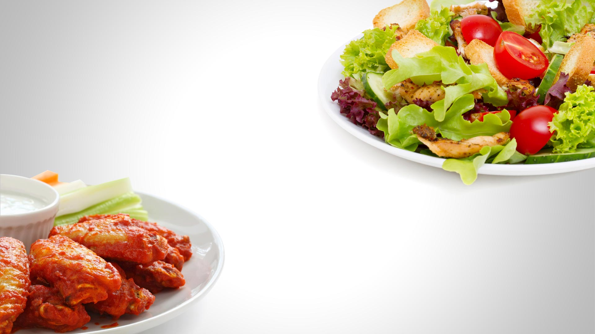

# Restaurant Menuboard Template 

## Introduction

The Restaurant Menuboard Template was created to display easy-to-read food and beverage prices while providing eye-catching food imagery to whet appetites. A preview of the template can be seen here: http://rise-vision.github.io/content-templates/restaurant-menuboard/restaurant-menuboard.html

##Steps to run the Restaurant Menuboard Template:##

1. Fork or download the entire content-templates repository.


2. Modify the files within the restaurant-menuboard folder directory to fit your needs. (see below on how to modify specific elements)


3. Host the entire “restaurant-menuboard” folder directory in rise vision storage or your web hosting service.


4. Copy the link to the restaurant-menuboard.html file where you have it hosted and insert the url into a schedule. (you can also add this link to the url gadget within a presentation)


##Directions to modify the Restaurant Menuboard Template:##

####Changing the background image
Open restaurant-menuboard.html, locate the following code and modify the src url of the img tag to the path of your new background:

```<div id="background">
    	
    </div>```

####Changing the text items
Open restaurant-menuboard.html. The menuboard is organized within two main div tags, one for items and prices on the left ```<div id="left-content">``` and one for the items and prices on the right ```<div id="right-content">```. 

The style of each menu item & price is controlled within restaurant-menuboard.css. There are 3 different media queries within the css used to control the font sizes. One for 1360x768, 1920x1080 and 3840x2160 which are the common display resolutions we see in digital sigange.


####Changing the animated icons
Open restaurant-menuboard.html. Locate the following code and modify the src url of the img tag to the path of your new icon:

``````

The icon animation utilizes css keyframes which can be changed inside the restaurant-menuboard.css style sheet by modifying the #flame-icon id.

## Built With
actual tools used
- HTML
- CSS
- Java Script

Restaurant Menuboard Template works in conjunction with [Rise Vision](http://www.risevision.com), the [digital signage management application](http://rva.risevision.com/) that runs on [Google Cloud](https://cloud.google.com).

At this time Chrome is the only browser that this project and Rise Vision supports.

## Submitting Issues
If you encounter problems or find defects we really want to hear about them. If you could take the time to add them as issues to this Repository it would be most appreciated. Please Identify the specific template that has the issue and follow the following format where applicable:

**Reproduction Steps**

1. did this
2. then that
3. followed by this (screenshots / video captures always help)

**Expected Results**

What you expected to happen.

**Actual Results**

What actually happened. (screenshots / video captures always help)

## Contributing
All contributions are greatly appreciated and welcome! If you would first like to sound out your contribution ideas please post your thoughts to our [community](http://community.risevision.com), otherwise submit a pull request and we will do our best to incorporate it.

### Suggested Contributions
- Creative ways to animate food imagery
- Dynamically update items and prices from custom data source
- i18n Language Support

## Resources
If you have any questions or problems please don't hesitate to join our lively and responsive community at http://community.risevision.com.

If you are looking for user documentation on Rise Vision please see http://www.risevision.com/help/users/

If you would like more information on developing applications for Rise Vision please visit http://www.risevision.com/help/developers/.

If you have any questions or problems please don't hesitate to join our lively and responsive community at http://community.risevision.com.
 
**Additional Content Templates can be found here: https://github.com/Rise-Vision/content-templates**

**Facilitator**

[Mathew Meiers](https://github.com/mmeiers "Mathew Meiers")
