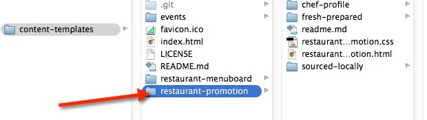
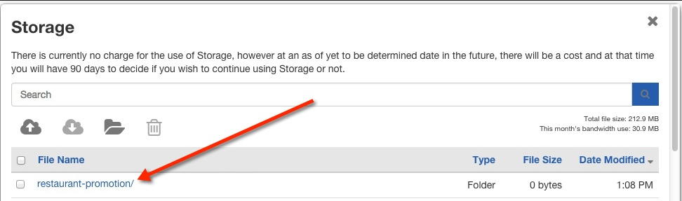

# Restaurant Promotion Template 

## Introduction

The Restaurant Promotion Template was created to display a series of high impact animated promotions that can be easily modified to accommodate your specific message. A preview of the template can be seen here: http://rise-vision.github.io/content-templates/restaurant-promotion/restaurant-promotion.html

##Steps to run the events template:##

1. Fork or download the entire content-templates repository.


2. Modify the files within the restaurant-promotion folder directory to fit your needs. (see below on how to modify specific elements)


3. Host the entire “restaurant-promotion” folder directory in rise vision storage or your web hosting service.


4. Copy the link to the restaurant-promotion.html file where you have it hosted and insert the url into a schedule. (you can also add this link to the url gadget within a presentation)


##Directions to modify the restaurant promotion template:##
####Removing or adding new promotions
The promotion template is comprised of 3 small webpages rotating in an iframe using javascript (one webpage for each promotion). 

To add or remove one of these promotions open the restaurant-promotion.html and locate the url aray. Change the array to reflect the desired promotion urls you would like to rotate:

```urls = ['http://s3.amazonaws.com/Content-Templates/restaurant-promotion/fresh-prepared/fresh-prepared.html','http://s3.amazonaws.com/Content-Templates/restaurant-promotion/sourced-locally/sourced-locally.html','http://s3.amazonaws.com/Content-Templates/restaurant-promotion/chef-profile/chef-profile.html']```

To change the duration of the promotions locate the following code and modify the number "10000" to reflect the time you would like them to play in millaseconds:

```setTimeout( arguments.callee, 10000 );```


####Changing the background image
Open chef-profile.html, fresh-prepared.html, or sourced-locally.html depending on which promotion you would like to modify. Locate the following code and modify the src url of the img tag to the path of your new background:

``` <div id="background">
    	
    </div>```

####Changing the text transition
The text transition of all three promotions were built with Edge Animate. To modify, open the text-transition.an file with Edge Animate. Each promotion has their own text-transition.an file.

Once you have made changes to this file you will need re-upload the entire edge_includes folder as well as the following files to your web hosting service: (text-transition.html , text-transition_edge.js, text-transition_edgePreload.js, text-transition_edgeActions.js).

If you do not have edge animate you can simply modify the arrays inside the text-transition_edge.js file to change the text. 

####Changing the logo
Open chef-profile.html, fresh-prepared.html, or sourced-locally.html depending on which promotion you would like to modify. Locate the following code and modify the src url of the img tag to the path of your new logo:

```<div id="logo">
    	
    </div>```

## Built With
actual tools used
- HTML
- CSS
- Java Script
- Edge Animate

Restaurant Promotion Template works in conjunction with [Rise Vision](http://www.risevision.com), the [digital signage management application](http://rva.risevision.com/) that runs on [Google Cloud](https://cloud.google.com).

At this time Chrome is the only browser that this project and Rise Vision supports.

## Submitting Issues
If you encounter problems or find defects we really want to hear about them. If you could take the time to add them as issues to this Repository it would be most appreciated. Please Identify the specific template that has the issue and follow the following format where applicable:

**Reproduction Steps**

1. did this
2. then that
3. followed by this (screenshots / video captures always help)

**Expected Results**

What you expected to happen.

**Actual Results**

What actually happened. (screenshots / video captures always help)

## Contributing
All contributions are greatly appreciated and welcome! If you would first like to sound out your contribution ideas please post your thoughts to our [community](http://community.risevision.com), otherwise submit a pull request and we will do our best to incorporate it.

### Suggested Contributions
- Alternative ways to animate background
- Alternative ways to animate text transitions
- Dynamically update events from custom data source
- i18n Language Support


## Resources
If you have any questions or problems please don't hesitate to join our lively and responsive community at http://community.risevision.com.

If you are looking for user documentation on Rise Vision please see http://www.risevision.com/help/users/

If you would like more information on developing applications for Rise Vision please visit http://www.risevision.com/help/developers/.

 If you have any questions or problems please don't hesitate to join our lively and responsive community at http://community.risevision.com.
 
**Additional Content Templates can be found here: https://github.com/Rise-Vision/content-templates**

**Facilitator**

[Mathew Meiers](https://github.com/mmeiers "Mathew Meiers")
