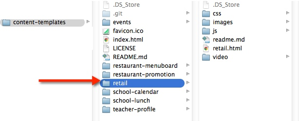
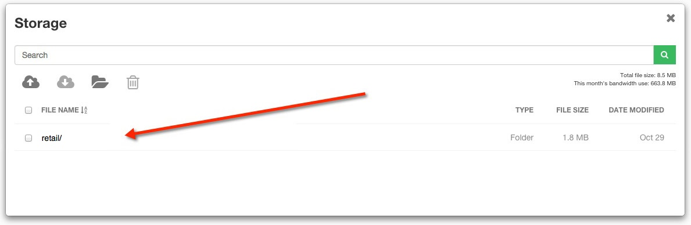

# Retail 

## Introduction

The Retail Template was created to show a social experience for a hashtag campaign as well as display tweets typical of a retail store. A preview of the template can be seen here: http://commondatastorage.googleapis.com/risemedialibrary-395c64e5-2930-460b-881e-009aabb157df/content-templates/retail/retail.html

##Steps to run the Retail Template:##

1. Fork or download the entire content-templates repository.  


2. Modify the files within the retail folder directory to fit your needs (see below on how to modify specific elements).  


3. Host the entire “retail” folder directory in rise vision storage or your web hosting service.  


4. Copy the link to the retail.html file where you have it hosted and insert the url into a schedule. (you can also add this link to the url gadget within a presentation)  


##Directions to modify the Retail Template:##

####Changing the background video
Open retail.html, locate the following code and modify the src url of the source tag to the path of your new background:

```
<video autoplay loop poster="http://goo.gl/ds7i6K" id="bg-video">
    <source src="video/bg-video" type="video/mp4">
</video>
```
 
####Changing The Hashtag Message
Open retail.html, the hashtag message content is nested within the div ```<div id="hashtag-container">``` Modify the text within the span and table tags to meet your needs. 

The style of the hashtag content is controlled within css/retail.css. There are 4 different media queries within the css used to control the font sizes. One for 1280x850, 1360x768, 1920x1080 and 3840x2160 which are the common display resolutions we see in digital signage.

####Changing Twitter
Open js/twitter.js, in order to change the twitter handle you will need to create a widget within your twitter account and link to it by ID. See comments on step by step process on how to do this.

The style of the twitter content is controlled within css/twitter.css. There are 4 different media queries within the css used to control the font sizes. One for 1280x850, 1360x768, 1920x1080 and 3840x2160 which are the common display resolutions we see in digital signage. 
 
## Built With
actual tools used
- HTML
- CSS
- Javascript

Retail Template works in conjunction with [Rise Vision](http://www.risevision.com), the [digital signage management application](http://rva.risevision.com/) that runs on [Google Cloud](https://cloud.google.com).

At this time Chrome is the only browser that this project and Rise Vision supports.

## Submitting Issues
If you encounter problems or find defects we really want to hear about them. If you could take the time to add them as issues to this Repository it would be most appreciated. Please Identify the specific template that has the issue and follow the following format where applicable:

**Reproduction Steps**

1. did this
2. then that
3. followed by this (screenshots / video captures always help)

**Expected Results**

What you expected to happen.

**Actual Results**

What actually happened. (screenshots / video captures always help)

## Contributing
All contributions are greatly appreciated and welcome! If you would first like to sound out your contribution ideas please post your thoughts to our [community](http://community.risevision.com), otherwise submit a pull request and we will do our best to incorporate it.

### Suggested Contributions
- Alternative ways to animate background
- Alternative ways to animate and transition between content
- Dynamically update hashtag message from custom data source like google spreadsheets
- i18n Language Support

## Resources
If you have any questions or problems please don't hesitate to join our lively and responsive community at http://community.risevision.com.

If you are looking for user documentation on Rise Vision please see http://www.risevision.com/help/users/

If you would like more information on developing applications for Rise Vision please visit http://www.risevision.com/help/developers/.

 If you have any questions or problems please don't hesitate to join our lively and responsive community at http://community.risevision.com.
 
**Additional Content Templates can be found here: https://github.com/Rise-Vision/content-templates**

**Facilitator**

[Mathew Meiers](https://github.com/mmeiers "Mathew Meiers")